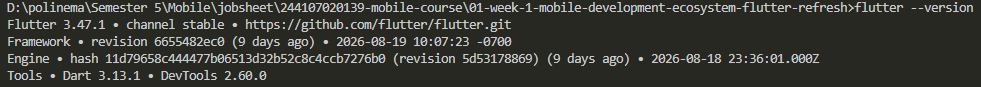

# Dart refresh
## Dasar Dart yang perlu diingat

## Null safety

## Latihan mandiri

# Menyiapkan environment
## Instalasi dan verifikasi

## Target perangkat

# Praktikum: aplikasi Flutter pertama

# Mini assignment

