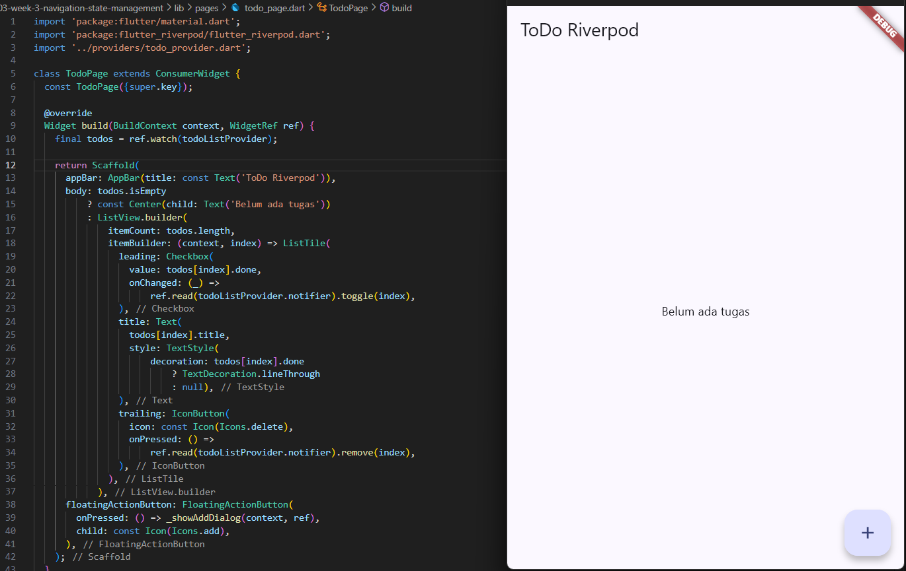
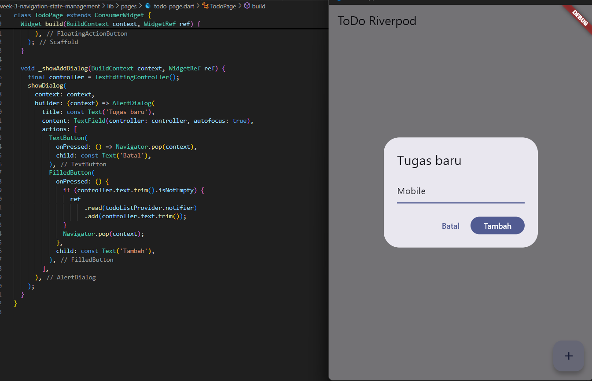
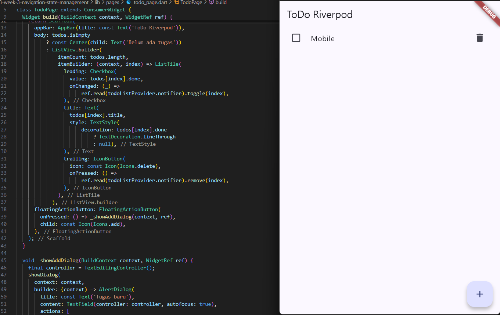
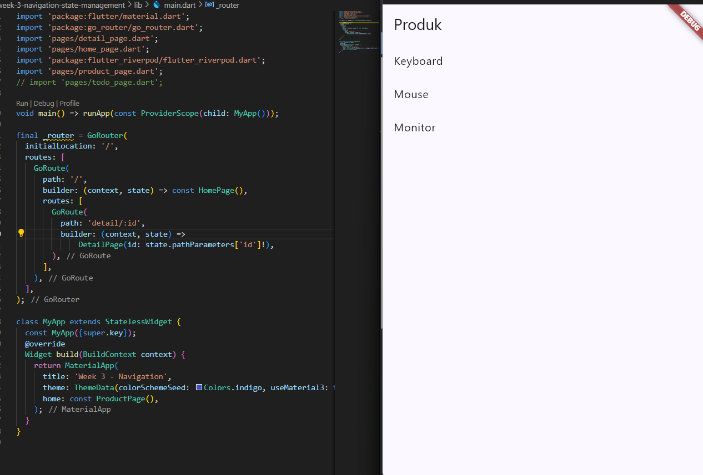
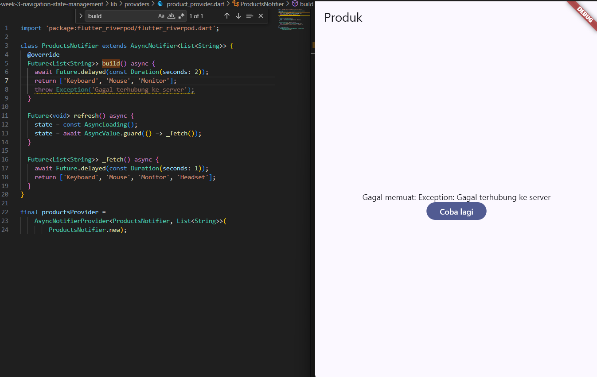
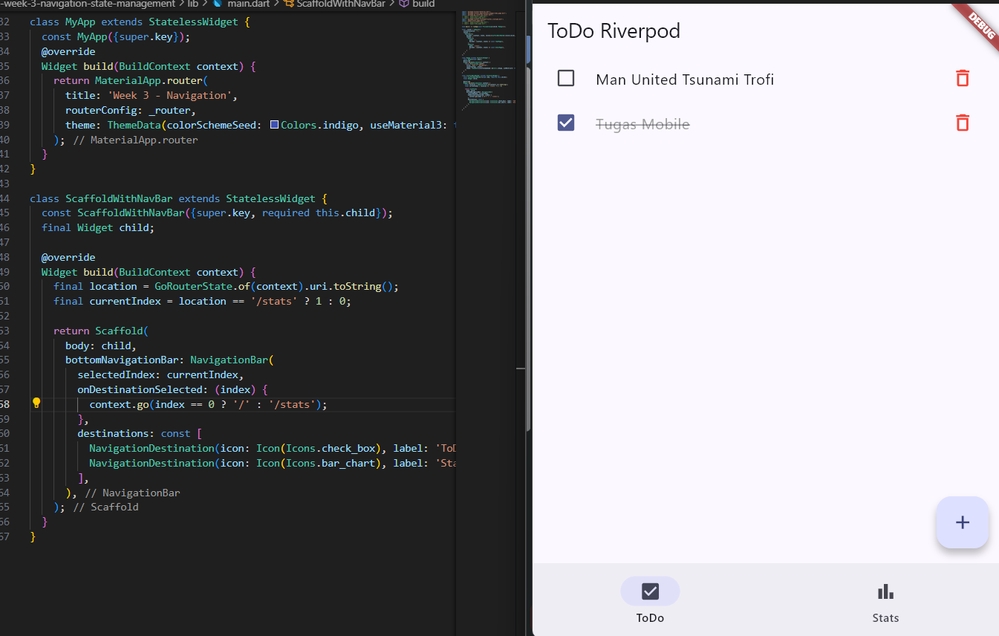
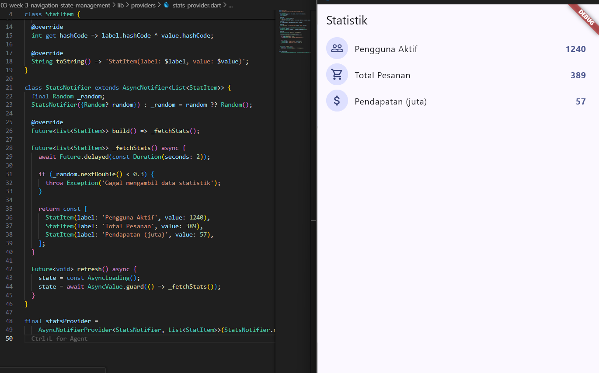
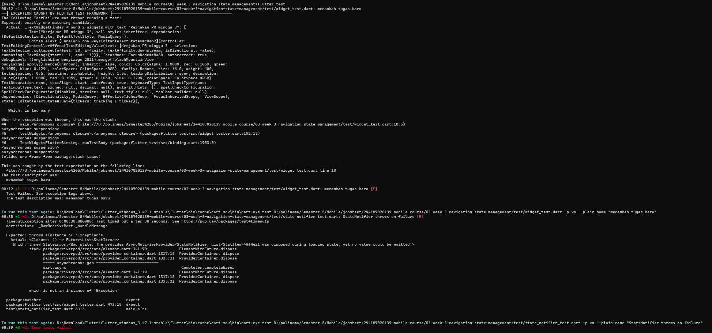

# 03 — Navigation & State Management

Laporan mini project Week 3: aplikasi ToDo dengan navigasi (GoRouter) dan state management (Riverpod), sesuai ketentuan codelab [#03 | Navigation & State Management](https://jti-polinema.github.io/flutter-codelab/03-minggu-3-navigation-state-management/index.html).

## Tujuan

- Menerapkan navigasi multi-page dengan **GoRouter**, termasuk path parameter dan akses path langsung.
- Menerapkan **state management** dengan Riverpod (`Notifier`, `ConsumerWidget`, `ref.watch`/`ref.read`) untuk aplikasi ToDo.
- Menangani state asinkron (**loading**, **error**, **success**) dengan `AsyncValue`/`AsyncNotifier`.
- Memverifikasi implementasi dengan unit test dan widget test.
- Menggunakan AI secara terbatas sebagai co-developer (AI Prompt Challenge), dengan verifikasi dan perbaikan manual.

## Fitur utama

- **Navigasi multi-page** — daftar item → halaman detail lewat path parameter (`/detail/:id`).
- **ToDo list** — tambah, tandai selesai, dan hapus tugas; state dikelola lewat `NotifierProvider`.
- **Halaman Statistik (Stats)** — mensimulasikan pengambilan data asinkron dengan kemungkinan gagal, menampilkan ketiga state `AsyncValue` (loading/error/success) lengkap dengan tombol "Coba lagi".
- **Bottom navigation** — berpindah antara halaman ToDo (`/`) dan Stats (`/stats`) memakai `NavigationBar` + `ShellRoute`.
- **Unit test & widget test** — memverifikasi `StatsNotifier` (sukses, gagal, refresh) dan alur tambah tugas di UI.

## Stack teknologi

| Komponen | Package/Tool |
|---|---|
| Framework | Flutter |
| Navigasi | [go_router](https://pub.dev/packages/go_router) |
| State management | [flutter_riverpod](https://pub.dev/packages/flutter_riverpod) |
| Testing | `flutter_test`, `ProviderContainer` (Riverpod) |
| AI assistant (terbatas, AI Challenge) | Lihat dokumentasi di `docs/ai-verification.md` |

## Struktur folder

```
03-week-3-navigation-state-management/
├── lib/
│   ├── main.dart
│   ├── pages/
│   │   ├── home_page.dart
│   │   ├── detail_page.dart
│   │   ├── todo_page.dart
│   │   └── product_page.dart
│   ├── providers/
│   │   ├── todo_provider.dart
│   │   ├── product_provider.dart
│   │   └── stats_provider.dart
│   └── widgets/
│       └── todo_tile.dart
├── test/
│   ├── widget_test.dart
│   └── stats_notifier_test.dart
├── docs/
│   └── ai-verification.md
├── screenshots/
└── README.md
```

## Cara menjalankan

```
flutter pub get
flutter run
```

Menjalankan verifikasi:

```
flutter analyze
flutter test
```

## Dokumentasi implementasi

### Praktikum 1 — Navigasi multi-page dengan GoRouter

Halaman **Home** menampilkan daftar 10 item; setiap item menuju halaman **Detail** lewat `context.go('/detail/:id')` dengan path parameter.


Halaman **Detail** membaca `id` dari `state.pathParameters` dan menampilkannya.


### Praktikum 2 — Aplikasi ToDo dengan Riverpod

`TodoPage` (`ConsumerWidget`) membaca `todoListProvider` lewat `ref.watch`, menampilkan state kosong ("Belum ada tugas") saat daftar masih kosong.



Dialog tambah tugas baru, dipanggil dari `FloatingActionButton`, menambahkan item lewat `ref.read(todoListProvider.notifier).add(...)`.



Daftar ToDo setelah item ditambahkan, lengkap dengan `Checkbox` (toggle selesai) dan tombol hapus.



### Praktikum 3 — AsyncValue (loading, error, success)

`ProductsNotifier`/`ProductPage` menampilkan state **success** — daftar produk setelah delay 2 detik simulasi network.



Saat `build()` sengaja dibuat melempar exception, UI menampilkan state **error** beserta pesan dan tombol "Coba lagi" yang memanggil `ref.invalidate(productsProvider)`.



### Refactoring Challenge — Integrasi GoRouter + NavigationBar

`MyApp` menggunakan `ShellRoute` dengan `NavigationBar` untuk berpindah antara `/` (ToDo) dan `/stats` (Stats), state ToDo tetap bertahan saat berpindah tab karena `todoListProvider` bersifat global di dalam `ProviderScope`.



### AI Prompt Challenge — StatsPage

Prompt yang digunakan (sesuai instruksi codelab bagian AI Prompt Challenge) meminta AI membuatkan `StatsPage` + `AsyncNotifierProvider` yang mensimulasikan pengambilan data statistik dengan kemungkinan gagal 30%, menangani ketiga state AsyncValue, beserta unit test. Hasil akhir setelah diverifikasi dan diperbaiki (detail proses verifikasi ada di `docs/ai-verification.md`):



### Testing

Hasil awal `flutter test` menemukan dua kegagalan — race condition animasi dialog pada widget test, dan Future yang belum di-`await` pada test `StatsNotifier` — yang kemudian diperbaiki (rincian ada di `docs/ai-verification.md`).



## Hasil yang dicapai

- Navigasi GoRouter berjalan: perpindahan Home → Detail lewat path parameter, serta perpindahan tab ToDo ↔ Stats lewat `NavigationBar`.
- `ProviderScope` membungkus root aplikasi; state ToDo (`todoListProvider`) terbukti tidak hilang saat berpindah halaman/tab.
- UI `AsyncValue` menangani ketiga state — loading, error (dengan retry), dan success — bukan hanya jalur sukses.
- `flutter analyze` bersih tanpa issue setelah membersihkan unused import, unused local variable, dan `unnecessary_underscores`.
- Seluruh test (`widget_test.dart` dan `stats_notifier_test.dart`) lulus setelah perbaikan `pumpAndSettle()` dan `await expectLater(...)`.
- Kode hasil AI (AI Prompt Challenge) sudah diverifikasi terhadap AI Verification Checklist dan didokumentasikan di `docs/ai-verification.md`.

## Checklist verifikasi mandiri

- [x] Navigasi GoRouter bekerja: pindah halaman, back, dan akses path detail langsung.
- [x] ProviderScope membungkus root aplikasi; state ToDo bertahan saat berpindah halaman.
- [x] UI AsyncValue menangani loading, error, dan success, bukan hanya success.
- [x] `flutter analyze` tanpa issue dan semua test lulus.
- [x] Hasil AI diverifikasi dan didokumentasikan pada folder `docs/`.

## Referensi

- [Codelab #03 — Navigation & State Management](https://jti-polinema.github.io/flutter-codelab/03-minggu-3-navigation-state-management/index.html)
- [GoRouter package](https://pub.dev/packages/go_router)
- [Riverpod: Getting started](https://riverpod.dev/docs/introduction/getting_started)
- [Riverpod: AsyncNotifier dan AsyncValue](https://riverpod.dev/docs/concepts/async_notifiers)